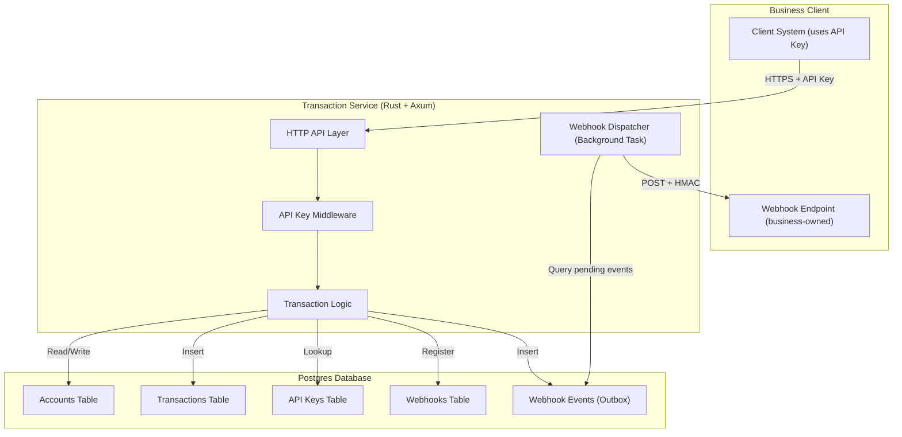
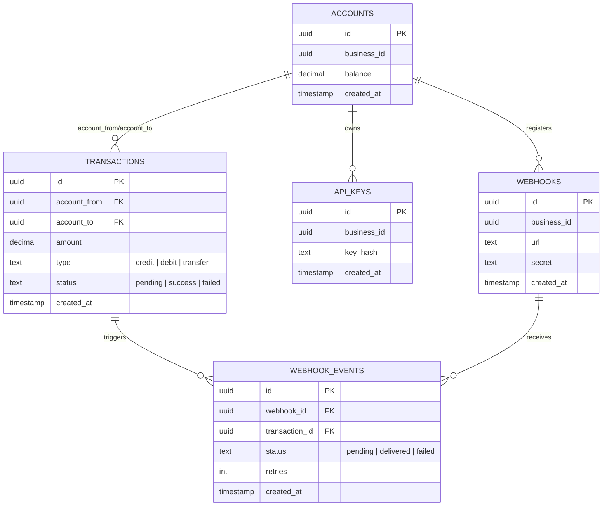

# Transaction Service — Design Document

This document describes architecture, data model, API, webhook design, security and operational trade-offs for the Transaction Service.

## Overview
- Simple transaction service supporting accounts, transactions, API keys and webhook subscriptions.
- Built with Axum + SQLx + Postgres.

## Schema (high level)
- accounts(id UUID, business_name, balance NUMERIC,...)
- transactions(id UUID, from_account, to_account, amount, txn_type, status, created_at)
- api_keys(id UUID, account_id, key, created_at, last_used)
- webhooks(id UUID, account_id, url, secret)
- webhook_events(id UUID, webhook_id, txn_id, delivered, retry_count, last_attempt)

## API Endpoints (summary)
- POST /api/accounts — create account (public)
- POST /api/api-keys — create API key (public)
- GET /api/accounts — list accounts (protected)
- GET /api/accounts/{id} — get account (protected)
- GET /api/accounts/{id}/balance — get balance (protected)
- POST /api/transactions — create transaction (protected)
- GET /api/transactions — list transactions (protected)
- POST /api/webhooks — register webhook (protected)
- GET /api/webhooks — list webhooks (protected)

All protected endpoints require the `x-api-key` header with a valid API key. Errors use a consistent JSON shape: `{ error: <code>, message: <human message> }`.

## Webhook design
- When a transaction is created, the service finds webhooks for involved accounts, inserts a `webhook_events` row and attempts delivery asynchronously.
- Delivery includes retries with exponential backoff and updates to `webhook_events` with `delivered` and `retry_count`.
- Requests include `X-Webhook-Secret` header with the secret; a recommended improvement is to include an `X-Signature` HMAC-SHA256 header over the body using the secret, so receivers can verify payload integrity.

## Security
- API keys are random 32-character tokens stored in DB.
- `x-api-key` header is required for protected endpoints. `last_used` is updated on each validated request.
- Webhook secrets are stored per-webhook and used for signing headers.

## Operational considerations
- Migrations are included in `/migrations`. Docker entrypoint applies up migrations on container start.
- Logging is enabled with `tracing` and `RUST_LOG` environment variable.
- Health: `/health` endpoint returns `OK`.

## Trade-offs and improvements
- Idempotency keys: Not implemented; recommended for safety on retryable transaction endpoints.
- Rate limiting: Not implemented; recommend per-API-key rate limiter using an in-memory store or Redis.
- Observability: Add OpenTelemetry + metrics and instrument webhook retries and delivery latency.
- Schema migrations: Current approach runs SQL files on container start — for production, use a proper migration tool (refinery, diesel migrations or flyway).

## Architecture diagram and ERD
The following diagram shows how client systems interact with the Transaction Service, its internal components, and the database.

### ER Diagram
The ER diagram describes the relational model for accounts, transactions, API keys, and webhooks:

