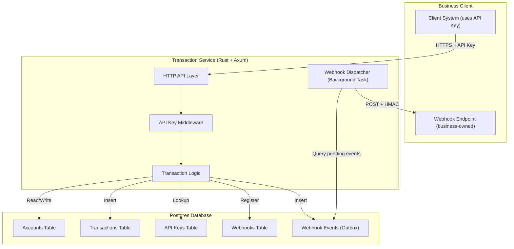
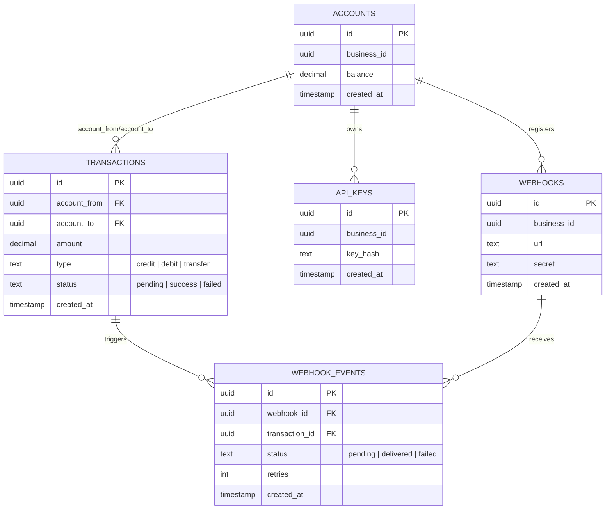

## 🏗️ System Architecture
The following diagram shows how client systems interact with the Transaction Service, its internal components, and the database:

## 🗄️ Database Schema (ERD)
The following ER diagram describes the relational model for accounts, transactions, API keys, and webhooks:

